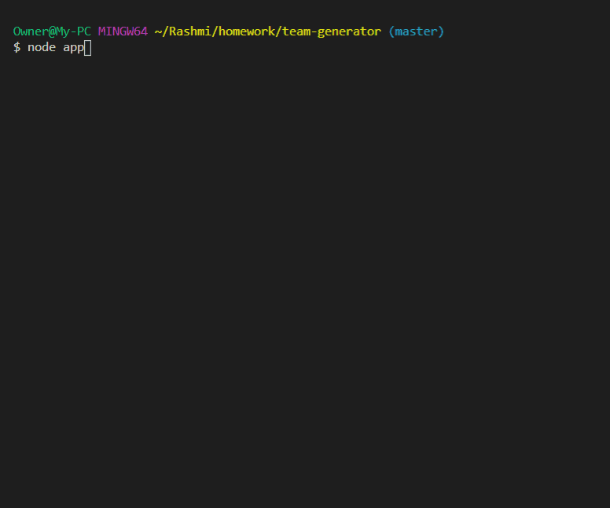

# Team-generator

  
## Table of contents:
-   [ Description ](#description)
-   [ Installation ](#installation)
-   [ Usage ](#usage)
-   [ Test ](#test)
-   [ License ](#license)
## <a name="description"></a>Description:
'Team-generator' is a command line application that takes in information about employees and generates an HTML webpage that displays summaries for each person. It uses OOP's inheritance concept to develop emplyoee team. Powered by Node js.
## <a name="installation"></a>Installation:

```bash
npm init
npm i inquirer 
npm i jest
```
## <a name="usage"></a>Usage:
```bash
node app
```



## <a name="contributing"></a>Contributing:
Pull requests are welcome. For major changes, please open an issue first to discuss what you would like to change.Code of Conduct: Standard (Fork, Clone, Commit, Push and Create Pull requests).
## <a name="test"></a>Test:
 ```bash
npm run test
```
## <a name="license"></a>License:
 <i>MIT Copyright (c). All rights reserved.</i>

